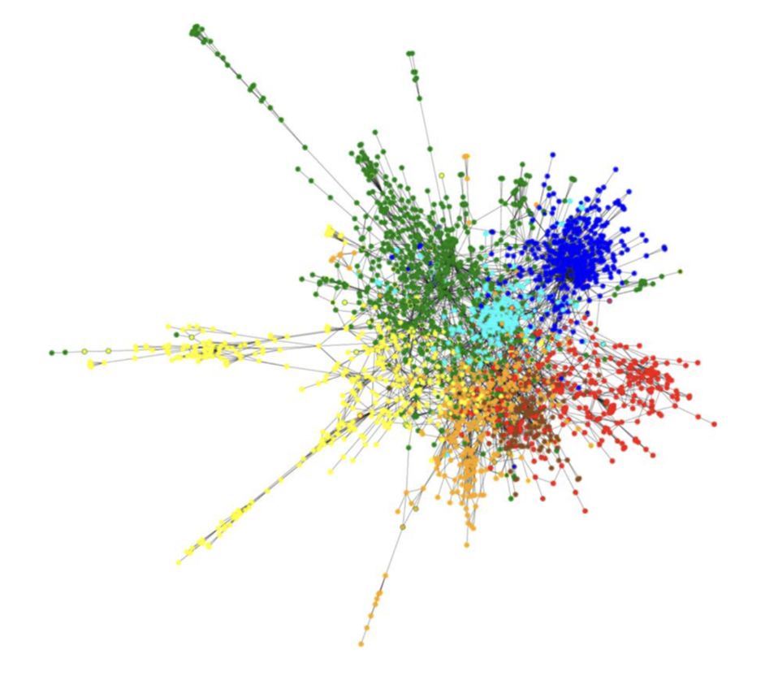
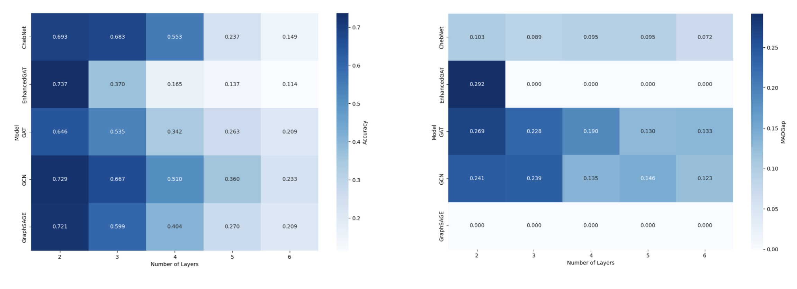
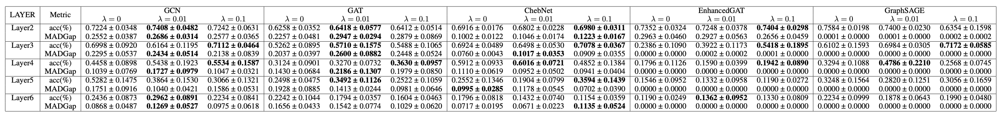
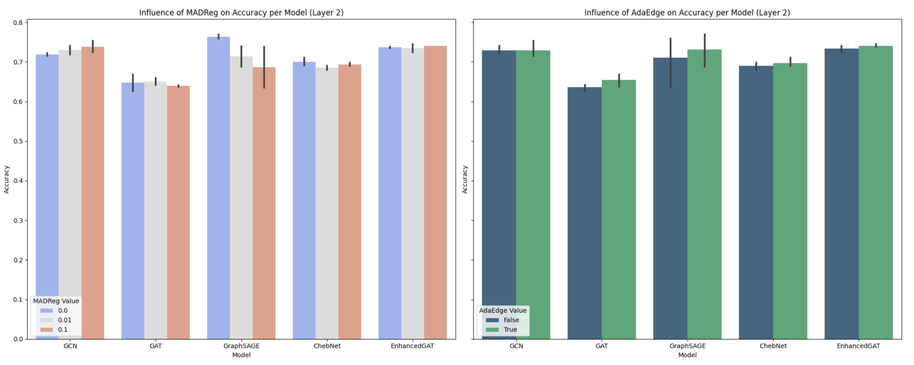

# Overcoming Over-Smoothing in Graph Neural Networks

## Description
This project explores the challenge of over-smoothing in Graph Neural Networks (GNNs) and evaluates innovative approaches to mitigate its effects. By experimenting with AdaEdge and MADReg, we aim to enhance the predictive power of GNNs. Over-smoothing leads to homogenized node features, diminishing their discriminative power. Our goal is to enhance GNNs' ability to distinguish between node features and thus improve the overall performance of the models. We decided to focus here on the Cora Dataset here illustrated which consists of 2708 scientific publications classified into one of seven classes. The citation network consists of 5429 links. Each publication in the dataset is described by a 0/1-valued word vector indicating the absence/presence of the corresponding word from the dictionary. The dictionary consists of 1433 unique words.


*Graph representation of the Cora dataset*

Our results indicate that careful application of regularization techniques can effectively mitigate over-smoothing. A detailed analysis can be found in our [project report](reports/Overcome-Over-Smoothing-in-Graph-Neural-Networks/reports/Overcome-Over-Smoothing-in-Graph-Neural-Networks.pdf).


## Results
Our findings confirm the effectiveness of AdaEdge and MADReg, especially in networks with fewer layers. We first illustrated the negative correlation between the overall performance of the models, the number of layers and MADGap metric which is a proxy for the over-smoothing in GNN.



In our the final table we show that the MADReg method for $\lambda = 0.1$ and $\lambda = 0.01$ comes with better performance of the model and less over-smoothing (controlled by MADGap) except for GraphSAGE model.


*Accuracy and MADGap metrics comparison across different GNN models with and without MADReg regularization*

We also computed the AdaEdge (Adaptive Edge Optimization) method from [Chen et al. (2019)](https://arxiv.org/pdf/1909.03211) which directly optimize the graph topology based on the model predictions. Eventually, we highlighted that the best trade-off is to apply MADReg regularization and AdaEdge method for model with two layers. 




## Installation

**1. Clone the repository to your local machine**

```bash
git clone https://github.com/LaFerraille/Overcome-Over-Smoothing-in-Graph-Neural-Networks.git
cd project
```

**2. Install the required Python libraries**

```bash
pip install -r requirements.txt
```

